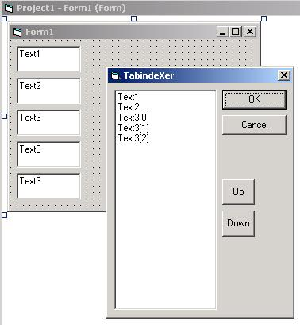



## TabindeXer

### Description

This handy VB addin allows you to set the tabindex of the controls of a form. Imangine having to set the order in a +100 control form, this makes it easy. It also omits labels and other controls wich cannot get the focus.
 
### More Info
 

             |
---                |---
**Submitted On**   |2001-04-13 13:38:04
**By**             |[Networking\.be](https://github.com/Planet-Source-Code/PSCIndex/blob/master/ByAuthor/networking-be.md)
**Level**          |Advanced
**User Rating**    |4.3 (30 globes from 7 users)
**Compatibility**  |VB 5\.0, VB 6\.0
**Category**       |[Miscellaneous](https://github.com/Planet-Source-Code/PSCIndex/blob/master/ByCategory/miscellaneous__1-1.md)
**World**          |[Visual Basic](https://github.com/Planet-Source-Code/PSCIndex/blob/master/ByWorld/visual-basic.md)
**Archive File**   |[TabindeXer183164132001\.zip](https://github.com/Planet-Source-Code/networking-be-tabindexer__1-22376/archive/master.zip)

